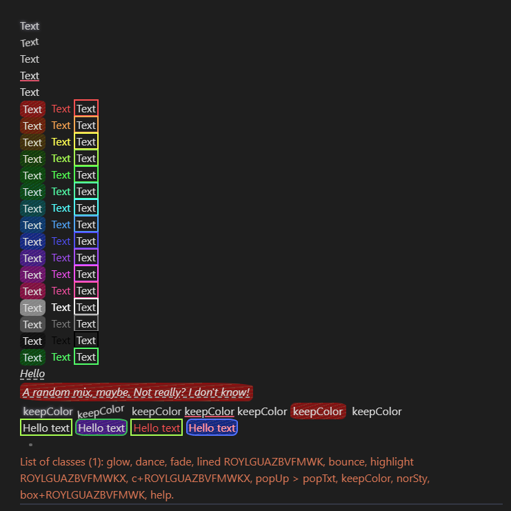
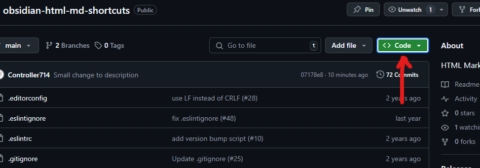
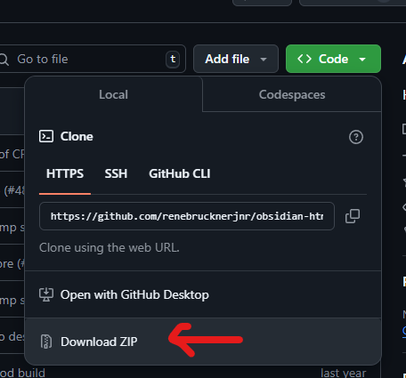
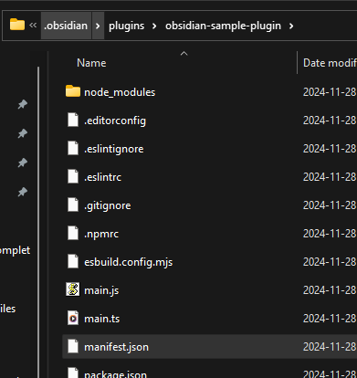

# Obsidian HTML Markdown Shortcuts (HTML-MD-SC)

Adds <span style="color:#D05050;background:#1E1E1E;">HTML</span> markdown with CSS snippets, as well as shortcuts for them.



<video src="popUpTxtExample.mp4" width="350" muted loop autoplay>&lt;video&gt; not supported</video>

> Use `<i id="help"></i>` to get a list of useable classes.
> Use the `demo` command to get a demonstration of tge plugin.

## Install through terminal:

```bash
cd "C:\<YourVaultDirectoryOrPath>\.obsidian\plugins"
git clone https://github.com/renebrucknerjnr/obsidian-html-md-shortcuts.git
```

## Install with download:
1. 

2. 

3. Then move the extracted folder into `C:\<YourVaultDirectoryOrPath>\.obsidian\plugins`



4. If that doesn't work follow the directions on the [Obsidian Help](https://help.obsidian.md/Extending+Obsidian/Community+plugins) page.

***

##### You could also download the `styles.css` and use the classes with snippets and not the plugin.
